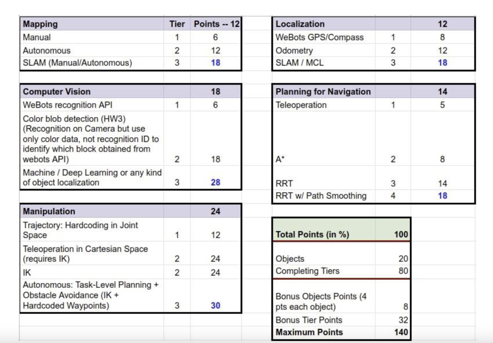

# Robotics-Project

1. You are provided with a grocery supermarket world and the Tiago robot that has a mobile base and a
manipulator for you to use. The mobile base is the same as in the labs and you will use it to move
your robot around and the manipulator (arm) will be used to pick-and-place objects into the basket
attached to the robot. The robot is equipped with a LiDAR and a camera. You can add/remove
sensors, but you will need to describe what sensing you require in your report.

2. There are objects that need to be collected spread across the store and your goal is to collect the
maximum number of objects possible.

3. Your score will depend on the number of objects you collect (20%) and the methods you use to
collect them (80%).

4. You should NOT collect any objects that are not goal objects. Each goal object has 2 points and
there are 2 bonus objects (GREEN CUBES) that are worth 4 pts each that can only be collected if
you are able to do obstacle avoidance manipulation planning (No, you cannot move the obstacles
away to clear your path).

Your goal objects are ONLY YELLOW CUBES.
5. This task will require these 5 components:
  
  a. Mapping - You need Lab 5 like mapping to do planning for your robot’s base movement.
  b. Localization - You need to know the robot pose in order to execute your plan.
  c. Computer Vision (CV) - You need CV to find out the objects of interest.
  d. Planning for Navigation - You need to do path planning in order to avoid obstacles and reach a
  point where you can then use the robot arm to pick-and-place the objects.
  e. Manipulation - You need to plan using the arm to pick-and-place the objects in the basket

  
